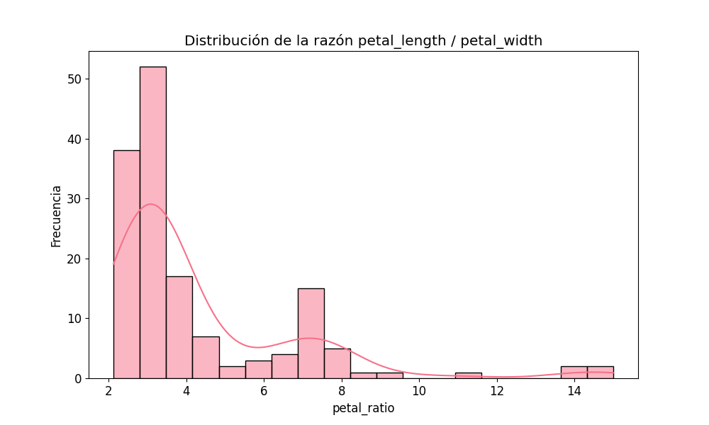
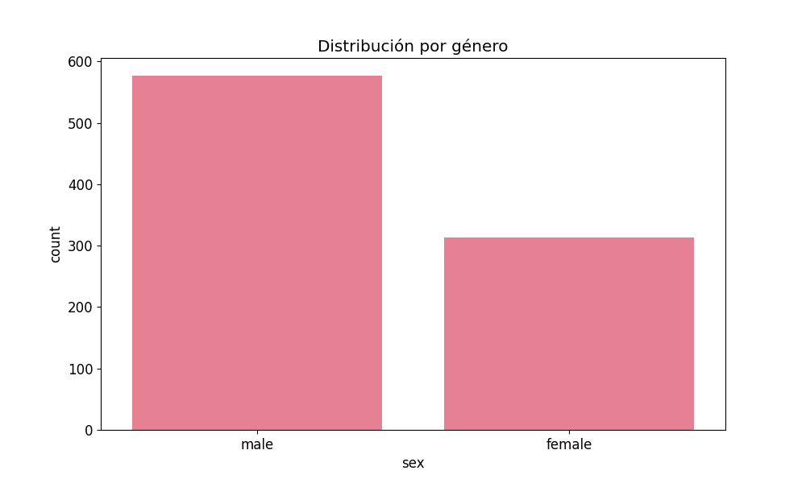
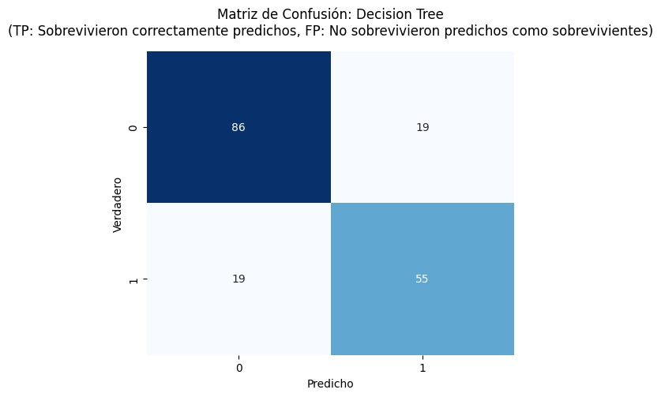
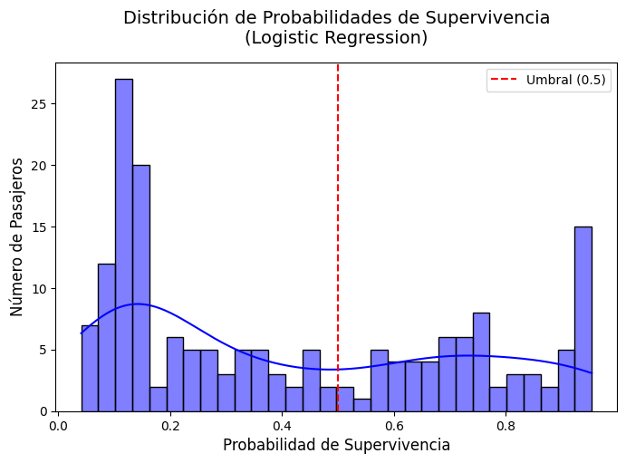

# Actividad 1: Laboratorio Práctico en Google Colab

## Estructura del Proyecto

```
├── 01_Fundamentos_NumPy_Pandas
│   ├── 01_Fundamentos_NumPy_Pandas.ipynb
│   └── images
│       └── 01_iris_petal_ratio.png
│
├── 02_Visualizacion_Datos
│   ├── 02_Visualizacion_Datos.ipynb
│   └── images
│       ├── 02_titanic_genero.png
│       ├── 02_titanic_edad_clase.png
│       └── 02_wine_plot_interactivo.html
│
├── 03_Machine_Learning_Basico
│   ├── 03_Machine_Learning_Basico.ipynb
│   └── images
│       ├── accuracy_comparison.png
│       ├── confusion_matrix_decision_tree.png
│       ├── confusion_matrix_logistic_regression.png
│       ├── confusion_matrix_random_forest.png
│       ├── model_comparison.png
│       └── proba_distribution.png
│
├── 04_Deep_Learning_Intro
│   ├── 04_Deep_Learning_Intro.ipynb
│       ├── accuracy_plot.png
│       ├── confusion_matrix.png
│       ├── loss_plot.png
│       └── predicciones_random.png
│
└── README.md
│
└── requirements.txt
```

## Informe Ejecutivo

### Operaciones básicas con arrays en NumPy

```python
import numpy as np

# Crear un array 2x3
a = np.array([[1, 2, 3], [4, 5, 6]])
print("Array a:\n", a)
print("Shape (filas, columnas):", a.shape)
print("Tipo de dato:", a.dtype)

# Crear un array del mismo tamaño lleno de unos
b = np.ones((2, 3))
print("\nArray b:\n", b)

# Suma de arrays
print("\nSuma a + b:\n", a + b)
```
Se crearon dos arrays del mismo tamaño: a con enteros y b con valores 1.0. Al sumarlos, NumPy realiza la operación elemento a elemento, aplicando broadcasting de forma automática. Como uno de los arrays contiene valores flotantes, el resultado también es de tipo float. Esta operación demuestra cómo NumPy permite realizar cálculos vectorizados de forma simple y eficiente.

### 1. Fundamentos NumPy y Pandas
En el análisis se identificaron diferencias claras entre tipos de flores al comparar la proporción entre el largo y ancho de sus pétalos; Esta métrica permitió visualizar patrones que podrían ser útiles para clasificarlas automáticamente.


- Se trabajó con el dataset **Iris**.
- Se analizaron y manipularon datos utilizando arrays y DataFrames.
- Se creó una nueva métrica "petal_ratio" que permitió observar diferencias entre especies de flores.

### Análisis de resultados


| species     | sepal_length | sepal_width | petal_length | petal_width |
|-------------|--------------|-------------|--------------|-------------|
| setosa      | 5.006        | 3.428       | 1.462        | 0.246       |
| versicolor  | 5.936        | 2.770       | 4.260        | 1.326       |
| virginica   | 6.588        | 2.974       | 5.552        | 2.026       |


i. **Resumen estadístico por especie**:
   - La especie **virginica** tiene el mayor promedio de ´petal_ratio´, seguido de **versicolor** y finalmente **setosa**.
   - Esto indica que el largo del pétalo de *virginica* es desproporcionadamente mayor respecto a su ancho en comparación con las otras especies.
   - Esta diferencia puede ser utilizada como una variable discriminante para clasificación automática.

| sepal_length | sepal_width | petal_length | petal_width | species | petal_ratio |
|--------------|-------------|--------------|-------------|---------|--------------|
| 5.1          | 3.5         | 1.4          | 0.2         | setosa  | 7.0          |
| 4.9          | 3.0         | 1.4          | 0.2         | setosa  | 7.0          |
| 4.7          | 3.2         | 1.3          | 0.2         | setosa  | 6.5          |
| 4.6          | 3.1         | 1.5          | 0.2         | setosa  | 7.5          |
| 5.0          | 3.6         | 1.4          | 0.2         | setosa  | 7.0          |


ii. **Nueva columna petal_ratio**:
   - Se incorporó exitosamente como una nueva variable en el DataFrame.
   - La inspección inicial (.head()) muestra variabilidad en los valores, que será útil para análisis posterior.

iii. **Distribución visual**:
   - El histograma muestra que la mayoría de los valores de **petal_ratio** se concentran entre 2 y 6.
   - Hay picos notables alrededor de los valores 2.5 y 4, lo que probablemente corresponde a la especie *setosa*.
   - Las colas hacia la derecha muestran la presencia de valores altos asociados a *virginica*, confirmando su mayor razón pétalo.

### Evidencias

- [Notebook 1](./01_Fundamentos_NumPy_Pandas/01_Fundamentos_NumPy_Pandas.ipynb)
- 

La variable petal_ratio permite observar de forma clara las diferencias entre especies. La distribución presenta un sesgo hacia la izquierda, con la mayoría de valores concentrados entre 2 y 5, correspondientes a especies como versicolor y setosa, mientras que algunos valores extremos, mayores a 10 están asociados a virginica, lo que indica que esta última especie tiene pétalos más alargados proporcionalmente a su ancho. Esta nueva variable facilita el análisis discriminativo entre clases y puede resultar útil para tareas de clasificación supervisada.

### Conclusión

El análisis demostró que petal_ratio es una métrica efectiva para diferenciar especies de Iris. Gracias al uso combinado de NumPy y Pandas, fue posible crear, procesar y visualizar esta variable de manera eficiente. La distribución observada sugiere que esta métrica puede ser altamente útil como atributo en algoritmos de clasificación supervisada, tanto por su capacidad de segmentación como por su simplicidad de cálculo..

---


### 2. Visualización de Datos
El análisis visual permitió identificar patrones clave que facilitan la comprensión de los datos y revelan relaciones relevantes entre variables:

- **Caso Titanic**:  
  A través de gráficos como el boxplot de edad por clase y el gráfico de barras por género, se identificaron diferencias significativas en la distribución de pasajeros:

  - La **primera clase** presentaba una mayor proporción de **adultos**, con una media de edad más alta. En contraste, las clases **segunda y tercera** registraban una mayor presencia de **jóvenes**, evidenciando una posible desigualdad en el acceso a recursos y salvamento.  
  - El análisis de género mostró una **mayor cantidad de hombres** a bordo (gráfico de barras), especialmente en clases más bajas, lo cual puede haber influido en los índices de supervivencia y distribución de recursos.

- **Caso vinos**:  
  La visualización de variables químicas como **alcohol** y **acidez** evidenció **agrupaciones naturales** entre los tipos de vino. Estas diferencias permiten clasificar los vinos de manera automatizada, facilitando modelos de segmentación o predicción basados en características físico-químicas.

Se emplearon herramientas gráficas tanto **estáticas** (boxplots, gráficos de barras) como **interactivas** (plotly, altair) para facilitar el análisis, permitiendo descubrir patrones no evidentes en las tablas numéricas.

### Evidencias

- [Notebook 2](./02_Visualizacion_Datos/02_Visualizacion_Datos.ipynb)
- 
- 
- [Ver gráfico interactivo Wine](https://steven-sanchez-uees.github.io/UEES-IA-Semana1-Grupo2/02_Visualizacion_Datos/images/02_wine_plot_interactivo.html)

### Conclusión

La visualización no solo hizo la información más accesible y comprensible, sino que permitió descubrir relaciones ocultas entre variables clave, fundamentales para la toma de decisiones. Además, abrió la posibilidad de automatizar procesos analíticos como la segmentación, clasificación o predicción, mejorando la eficiencia del análisis exploratorio de datos.

---

### 3. Machine Learning Basico
En esta actividad aplicamos técnicas de Machine Learning supervisado para resolver un problema clásico: predecir si una persona sobrevivió o no al hundimiento del Titanic, basándonos en sus características personales como clase, sexo, edad, número de familiares, tarifa pagada, entre otros.

Para esto, utilizamos tres modelos de clasificación muy populares:
- Regresión Logística
- Árbol de Decisión
- Random Forest

Luego de entrenarlos, comparamos su desempeño mediante métricas como accuracy, precision, recall y F1-score, y visualizamos sus resultados a través de gráficos y matrices de confusión.

i. **Resultados Generales de Precisión**
<br>Al evaluar la precisión general de cada modelo, encontramos lo siguiente:
````
    Regresión Logística: 81.01%
    Random Forest: 79.89%
    Árbol de Decisión: 78.77%
````

ii. **Distribución de Probabilidades – Regresión Logística**
<br>Este gráfico nos ayuda a entender cómo el modelo de regresión logística calcula la probabilidad de supervivencia para cada pasajero. Como se observa, hay una clara separación en las predicciones: muchas personas tienen probabilidades muy bajas o muy altas, lo cual indica que el modelo está bastante seguro en la mayoría de sus decisiones.

La línea roja marca el umbral de decisión del modelo (0.5), que separa a los que fueron clasificados como sobrevivientes y no sobrevivientes.

iii. **Matrices de Confusión**
<br>Las siguientes gráficas muestran cuántas predicciones fueron correctas o incorrectas para cada modelo. Esto permite identificar qué tan bien aciertan en ambas clases (sobrevivientes y no sobrevivientes):
- **Regresión Logística**
  - Predijo correctamente a 90 personas que no sobrevivieron.
  - Predijo correctamente a 55 personas que sí sobrevivieron.
  - Se equivocó con 15 personas (falsos positivos) y con 19 (falsos negativos).
- **Árbol de Decisión**
    <br>Tuvo más errores que la regresión logística, especialmente clasificando a personas que no sobrevivieron.
- **Random Forest**
    <br>Su rendimiento fue intermedio entre los dos modelos anteriores, con un número de aciertos y errores muy balanceado.


En general, la regresión logística mostró el mejor equilibrio entre precisión y sensibilidad (F1-score), lo cual la convierte en una buena opción cuando se busca un balance entre ambos aspectos.

### Evidencias
- [Notebook 3](./03_Machine_Learning_Basico/03_Machine_Learning_Basico.ipynb)
- 
- 
- [Ver todas las imágenes](./03_Machine_Learning_Basico/images/)


### Conclusiones
- La Regresión Logística se posicionó como el mejor modelo en este caso, con el mayor puntaje de precisión y un buen balance general.
- Random Forest también mostró resultados sólidos, especialmente en términos de precisión.
- Aunque el Árbol de Decisión fue el más simple, tuvo una leve desventaja frente a los otros modelos.

-------

###  4. Deep Learning

Este notebook implementa una red neuronal multicapa utilizando TensorFlow y Keras para resolver un problema de clasificación multiclase basado en el dataset Iris. A través de este laboratorio se aborda el flujo completo de un modelo de Deep Learning desde el preprocesamiento hasta la evaluación con gráficas y métricas.

El modelo fue entrenado durante 30 epochs, que contiene imágenes de dígitos manuscritos de 8x8 píxeles. Los datos se normalizaron y codificaron en formato one-hot, dividiéndose en un 80% para entrenamiento y 20% para prueba. Además, del conjunto de entrenamiento se reservó un 20% para validación durante el entrenamiento, lo que permitió monitorear el rendimiento del modelo en cada época.

###  Resultados del entrenamiento

**Precisión (Accuracy)**

El siguiente gráfico muestra la evolución de la precisión durante las 30 épocas:


**Interpretación**:

El modelo muestra una mejora rápida de la precisión en las primeras 5 épocas, superando el 90% tanto en entrenamiento como en validación. A partir de ese punto, las curvas se estabilizan con una ligera ventaja del conjunto de entrenamiento, alcanzando casi el 100%. La precisión de validación se mantiene constante cerca del 95%, lo que indica un buen ajuste del modelo sin sobreentrenamiento.

---

**Pérdida (Loss)**

Este gráfico representa la pérdida del modelo durante el entrenamiento:


 **Interpretación**:
 
La pérdida del modelo disminuye rápidamente durante las primeras épocas, lo que indica un aprendizaje eficiente en las etapas iniciales. A partir de la época 10, ambas curvas (entrenamiento y validación) se estabilizan con valores cercanos a cero. La ligera separación entre ambas curvas es normal y sugiere que el modelo generaliza bien sin señales evidentes de sobreajuste.

---

### Evaluación del modelo

###  Matriz de Confusión

Representa la relación entre clases verdaderas y predichas:


 **Interpretación**:
 
La matriz de confusión muestra que la mayoría de las predicciones del modelo son correctas, con valores altos en la diagonal principal. Las clases más representadas (como los dígitos 4, 5 y 6) fueron clasificadas con alta precisión. Las pocas confusiones observadas se presentan principalmente entre dígitos visualmente similares, como el 8 y el 9. Esto indica que el modelo tiene un desempeño sólido y generaliza bien en la clasificación de todos los dígitos.

---

###  Predicciones aleatorias

Ejemplos visuales de predicciones en imágenes de prueba:


 **Interpretación**:

La visualización muestra ejemplos aleatorios de imágenes de prueba con sus respectivos valores verdaderos (V) y predichos (P). La mayoría de los dígitos fueron clasificados correctamente, lo que valida visualmente el rendimiento del modelo. Las métricas reportadas refuerzan esta observación:

| Métrica     | Valor aproximado |
|-------------|------------------|
| Accuracy    | 0.9583           |
| MSE         | 1.0167           |
| MAE         | 0.1778           |
| R2          | 0.8684           |

El modelo alcanza un 95.8% de precisión y presenta errores bajos, lo que indica un aprendizaje efectivo y una capacidad alta de generalización al clasificar dígitos escritos a mano.


---

##  Conclusión

El modelo de red neuronal profunda entrenado para la clasificación de dígitos manuscritos demostró un excelente rendimiento tanto en términos cuantitativos como visuales. Alcanzó una precisión del 95.8% con un bajo error MSE: 1.01, MAE: 0.17 y un coeficiente de determinación R2 de 0.86, lo que evidencia un ajuste sólido a los datos. Las curvas de entrenamiento muestran una rápida convergencia sin signos de sobreajuste, y la matriz de confusión confirma una alta tasa de aciertos en todas las clases. Además, las predicciones visuales reflejan una correcta interpretación de patrones por parte del modelo. 


### Evidencias


- [Notebook 4 - Deep Learning](./04_Deep_Learning_Intro/04_Deep_Learning_Intro.ipynb)

---


-------
> *Desarrollado por el Grupo 2 – Universidad Espíritu Santo (UEES)*
> 
> • Steven Sánchez [@steven-sanchez-uees](https://github.com/steven-sanchez-uees)<br>
> • Joel Espín [@joel-espin-uees](https://github.com/joel-espin-uees)<br>
> • Cristina Gramal [@cristina-gramal](https://github.com/cristina-gramal)<br>
> • Veronica Ochoa [@veritochoah](https://github.com/veritochoah)<br>
> • Darío Pérez [@dario-perez-v](https://github.com/dario-perez-v)<br>
> • Tomas Guijo [@tguijo](https://github.com/tguijo)<br>

